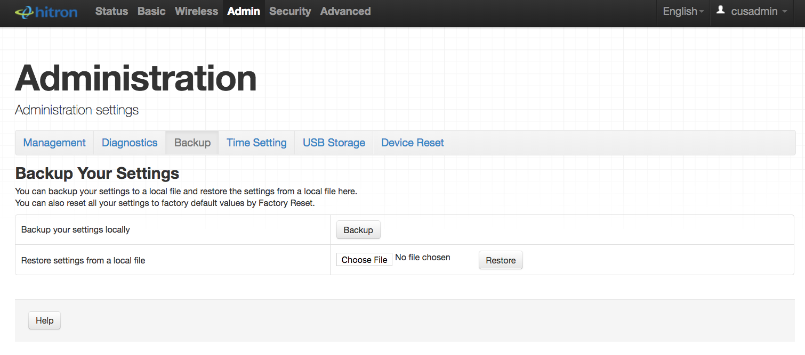

# Hitron CFG Decrypter

## Downloading

```sh
git clone https://github.com/Manouchehri/hitron-cfg-decrypter
cd hitron-cfg-decrypter/
```

## Decrypting

```sh
python decrypt.py -i sample.cfg.enc
```

## Encrypting

```sh
python decrypt.py -i sample.cfg.dec -m encrypt
```

## Getting the CFG



Thanks to Michael Henke (@henkman) for his previous work on the Hitron CVE-30360. 
